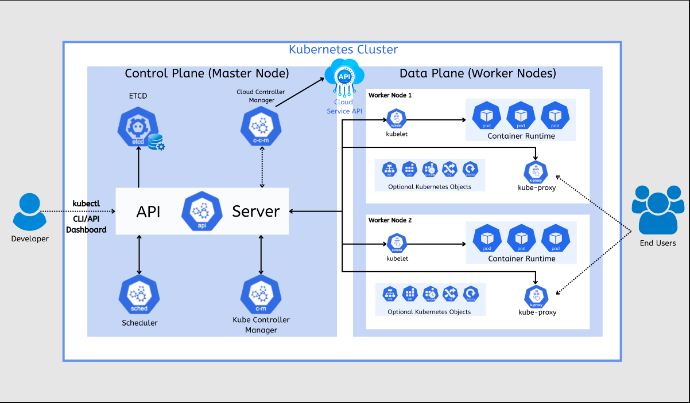

# Kubernetes


Conhecido de maneira abreviada por k8S, é uma solução open source ultilizada para automatizar e simplificar todo o processo de gerenciamento de containers linux.

Criado pela *Google* em 2014, reapidamente se tornou uma ferramenta poderosa no mundo de *Devops*, permitindo entregar eficiente de aplicações em contêiners. Ele tambem permite executar arquiteturas de diversos tipos de teclonogia tendo o poder de  inicialas com zero downtime. Por exemplo, se um de seus containers vem a cair, podemos programar um failover para que suba um outro container com 0 downtime.

## Ambientes de usabilidade

- Serviço de descoberta e Load balancing
    O Kubernets pode expor containers usando o DNS ou usando, ou usando seu proprio IP. Se o Trafego de requisições de um container subir, o Kubernets é capaz de balancear a carga das requisições de forma eficiente. Garantindo um *melhor desempenho* e alta disponibilidade. Além disso, pode iniciar contêineres automaticamente caso necessário. 

- Orquestração de storage
    Kubernets permite que você automatize montagem de um sistema de *storage*, suportando diferentes tipos de armazenamento como armazenamentos locais, provedores de nuvem pública(Aws, Google CLoud, azure) e muito mais.

- Auto-reparavel
    Renicia containers que falham, substitui contêineres, elimina contêineres que não respondem a verificação de integradade definida pelo usuaio e não os anuncia aos que cliente até que estejam prontos para ser atendidos.

- Gerenciamento de informações sigilosas
    Kubernetes da suporte ao manejamento de informações isgilosas, como senhas, OAuth tokens e chaves SSH. Você pode fazer a alteração destas Informações durante processo de deploy ou se não como atualização, sem necessariamente ter de reconstruir suas imagens.

- Auto Scaling 
    Aumenta ou diminua a escala do seu aplicativo com um comando simples ou automaticamente com base na CPU

- Alocação de endereços IPV4 e IPV6

- Projetado para crescimento
    - Adicione recursos ao seu cluster Kebernets sem alterar o codigo-font upstream.
    

## Contexto Historico do Kubernetes


Como podemos ver imagem acima,  essa foi nossa evolução que tivemos no mundo de virtualizações de servidores, primeiro começamos alocando os aplicativos diretemente encima do Sistema operacional mas com isso tinhamos problemas tais como.
- Um servidor para cada aplicação
- Não permitia gerenciamento de todos os serviços
- Ambientes de desenvolvimento afetados

Com isso foi surgindo a virtualização de servidores que conseguiam em um computador, alocar memoria, cpu e um sistema operacional, podendo separar cada serviço como uma VM. Foi um passo enorme, mas com isso as camadas de abstrações aumentando ficamos com uma principal dificuldade pelo fato de não conseguir virtualizar muitas maquinas, pois o sistema operacional carregado com cada VM era algo pesado de se rodar. Semelhante a uma VM, um contêiner tem seu próprio sistema de arquivos, compartilhamento de CPU, memória, espaço de processo e muito mais. Como eles são desacoplados da infraestrutura subjacente, eles são portáteis entre nuvens e distribuições de SO. 

Isso permitiu a camada de microserviços ficarem cada vez mais desacoplados, distribuidos, elástico e liberados. Os aplicatiovos são separados em partes menores independentes e podem ser implantados e gerenciados dinamicamente.


# Arquitetura Kubernetes


## Control Plane
Quando se contrata serviços de kubernetes sem clouds EKS, AKS, GKS não temos acesso ao control plane por se tratar de algo extremamente complicado de se gerenciar. Serviços da AWS como exemplo gerencia o control PLane para nós afim de que nós clientes coloque somente nossas operações para rodar. 

### Componentes

- `ETCD` 
    Banco de dados interno do kubernetes, um database do tipo chave e valor que armazena registros dos estados dos cluters, sendo extremamente necessário na aplicação.

- `API Server`
    Tudo se passa por ele, todos os nodes se coneversa com API server, mesmo ultilizando o *kubectl*(Linha de comando)  para se comunicar com um node, no fundo você esta fazendo uma requisição http para API.

- `Scheduler`
    Tem a responsabilidade de decidir em qual node irá colocar determinado POD, por exemplo, você cria um POD e ele vai para o estado de panding o scheduler vai analisar os recursos baseados em (CPU, RAM, etc) e irá decidir em qual node será melhor aplicado.

- `Kube Controller Manager`
    Conjunto de controladores responsável por manter o estado desejado do cluster, faz controles de jobs e helth check. Fazendo ações como replicações de pods, balanceamento e carga, failover.

- `Kube cloud controller`
    Ele divide a responsabilidade com o Controller Manager , quando o cluster está em nuvem ele lida com a API do provedor cloud, gerenciando: 
    - Loud Balances
    - Alocação de Ips para serviços do kubernetes
    - Gerenciamento de volumes de armazenamento em nuvem.

    Se você estiver rodando Kubernetes on-premises (em máquinas locais ou servidores próprios), este componente pode estar ausente ou desativado, pois não há integração com um provedor de nuvem.


## Data Planing



Local onde nossas aplicações irá rodar, geralmente ao se ultilizar ambientes public cloud é a aréa a qual temos acesso. Pois é onde nossa aplicação irá rodar, toda solução em nuvem fica responsavel de gerenciar para você o control plane.

### Componentes


- `POD`
    Representa a menor unidade do Kubernetes, representa o grupo de um ou mais containers. Os containers dentro de um POD compartilham:
    - Rede (Mesmo ip e portas)
    - Armazenamento(VOlumes compartilhados)
    - Configuração(Variaveis de ambientes, secrets, etc)


- `Node`
    Ou nós em tradução literária, node é uma Maquina fisica ou virtual com sistema operacional (Linux ou Windows) onde será executados os *Pods*. Cada Node precisa de certos componentes para executar containers, incluindo:
    - `Kubelet` -> Gerencia os Pods no node e se comunica com o API server, quem executa os helth check dos containers dentro daquele Pod.
    - `Kube-proxy` -> Controla a comunicação de rede entre Pods e services.
    - `Runtime de Container` -> Normalemente docker, engine para criar e rodar os containers.

    Em um cluster Kebernetes, há dois tipos de Nodes: 
    - `Control PLane Node`-> Onde o kubernetes gerencia o cluster ( Control Plane explicado acima)
    - `Worker NOde`-> Onde os aplicativos rodam. (Nodes ao lado do data Planing )


# Colocando a Mão na massa

Entendido um pouco mais sobre é a rquitetura do Kubernetes, podemos rodar versões em maquinas locais afins de estudos com ferramentas como:
- `Kind`
    - Document: 
    - Cria clusters Kubernetes dentro de containers DOcker
    - Bom para testes e desenvolvimento
    - Não precisa de VMs e somente docker
    
- `Minikube`
    - Roda kubernetes em umaquina local criando uma unica VM ou container
    - Suporta drivers como virtualbox, Docker.
    - Boa opção para o entendimento completo de um cluster real

- `K3S`
    - Kubernetes leve criado para dispositivos IoT e pequenos servidores
    - Muito recomendado para rodar com Raspberrry Py ou maquinas com pouca memoria


Para nosso cenário vamos criar ultilizando o Kind.
Documentação ultilizada para instalação: `https://kind.sigs.k8s.io/docs/user/quick-start/#installation`


# Instalação do Kind no linux

1. Instalar Binário: 

```bash
[ $(uname -m) = x86_64 ] && curl -Lo ./kind https://kind.sigs.k8s.io/dl/v0.27.0/kind-linux-amd64

```

2. Dar permissão

```bash
chmod +x ./Kind
```

3. Mover diretorio kind instalado para o diretorio de binario

```bash
sudo mv ./kind /usr/local/bin/kind
```

4. Testar instalação

```bash
kind version
```
Deve te retornar a versão do kind instalado.


## Dependencias necessárias
É necessário fazer a instalação do docker na maquina para fazer a instalação do kind.
```bash
sudo apt update && sudo apt install -y docker.io
sudo systemctl enable --now docker

```

# Configurações
Criar no diretório do projeto un config.yaml onde iremos ultilizar as configurações para criar nosso data planing e control planing.
Pegado direto da documentação do kind segue a config

```yml
kind: Cluster
apiVersion: kind.x-k8s.io/v1alpha4
nodes:
- role: control-plane
- role: worker
- role: worker
- role: worker
```

Rodar o comando para criar o nosso cluster

```bash
kind create cluster --config config.yaml
```
Ele irá fazer a criação do nosso cluster

```bash
Creating cluster "kind" ...
 ✓ Ensuring node image (kindest/node:v1.32.2) 🖼 
 ✓ Preparing nodes 📦 📦 📦 📦  
 ✓ Writing configuration 📜 
 ✓ Starting control-plane 🕹️ 
 ✓ Installing CNI 🔌 
 ✓ Installing StorageClass 💾 
 ✓ Joining worker nodes 🚜 
Set kubectl context to "kind-kind"
You can now use your cluster with:

kubectl cluster-info --context kind-kind

Have a nice day! 👋

Kubernets took 48.1s …

```

OQue o Kind basicamente fez foi criar os nodes através de uma imagem docker, um node por padrão é uma VM e dentro dessa VM rodas os nossos Pods que seria nossos containers docker. Oque o kind faz para facilitar o processo de instalação é criar um container docker para os nodes e dentro destes nodes criarmos nossos pods em docker. Famoso docker in docker.


Feito a criação do nosso cluster kubernetes, precisamos agora fazer a comunicação como nosso Cluster, que é feito através do Kubectl.
Para serguir a instalação de acordo com seu sistema operacional, segue aqui a documentação oficial para instalação.
- Doc para instalar o kubectl: https://kubernetes.io/pt-br/docs/tasks/tools/#kubectl

Como estou fazendo no linux ja deixo o passo a passo.

1. Instalar binário

```bash
    curl -LO "https://dl.k8s.io/release/$(curl -L -s https://dl.k8s.io/release/stable.txt)/bin/linux/amd64/kubectl"
```

2. Dar permissão
```bash
sudo chmod +x ./kubectl
```

3. Mover binário para instalação

```bash
 sudo mv -f kubectl  /usr/local/bin/
```

4. Verificar instalação

```
kubectl version
```

## Kubectl
Como falado anteriormente, o kubectl faz a comunicação direto com a API do nosso cluster através de linhas de comando.

Conseguimos ver uma lista de execução de pods dentro do nosso cluster rodando o comando.

```bash
kubectl get pod -A
```

Output

```bash
Kubernets …
➜ kubectl get pod -A
NAMESPACE            NAME                                         READY   STATUS    RESTARTS   AGE
kube-system          coredns-668d6bf9bc-pl4gd                     1/1     Running   0          13m
kube-system          coredns-668d6bf9bc-xjtkk                     1/1     Running   0          13m
kube-system          etcd-kind-control-plane                      1/1     Running   0          13m
kube-system          kindnet-gklrk                                1/1     Running   0          13m
kube-system          kindnet-pks4q                                1/1     Running   0          13m
kube-system          kindnet-pxb6b                                1/1     Running   0          13m
kube-system          kindnet-w7n6c                                1/1     Running   0          13m
kube-system          kube-apiserver-kind-control-plane            1/1     Running   0          13m
kube-system          kube-controller-manager-kind-control-plane   1/1     Running   0          13m
kube-system          kube-proxy-92nn5                             1/1     Running   0          13m
kube-system          kube-proxy-hdgxz                             1/1     Running   0          13m
kube-system          kube-proxy-nkzd9                             1/1     Running   0          13m
kube-system          kube-proxy-zqqg4                             1/1     Running   0          13m
kube-system          kube-scheduler-kind-control-plane            1/1     Running   0          13m
local-path-storage   local-path-provisioner-7dc846544d-h6b9k      1/1     Running   0          13m
```


Os namespaces Kube-system são destinados a Pods que executam o nosso sistema. 

- `coredns-668d6bf9bc-pl4gd` - > Resolução de DNS 
- `etcd-kind-control-plane` - > Banco de dados da aplicação kubernetes.
- `kindnet` ->  Responsavel por prover rede para as pods
- `kube-apiserver-kind-control-plane ` -> Nossa API kubernetes
- `kube-proxy` -> Responsavel por gerir as regras de iptables dos nodes
- `kube-scheduler-kind-control-plane`-> Responsavel por saber qual node irá executar uma pod

O kind é uma solução rapida para execução do kubernetes, ele cria tudo a partir de containers, mas em um ambiente real. Alguns destes serviços que estão como containers ou pods, podem ficar como daemons e serviços de segundo plano em execução, principalmente os componentes control plane. 


Para ver os nodes em execução basta dar o comando:

```bash
kubectl get node
```
Output
```bash
NAME                 STATUS   ROLES           AGE   VERSION
kind-control-plane   Ready    control-plane   24m   v1.32.2
kind-worker          Ready    <none>          24m   v1.32.2
kind-worker2         Ready    <none>          24m   v1.32.2
kind-worker3         Ready    <none>          24m   v1.32.2

```

Como esta no nosso arquivo de configuração, temos três workers nodes e um control plane node.


# Criar um POD

Comando para criar uma POD

```bash
kubectl run --image nginx nginx
```
Nginx se repete duas vezes sendo o primerio o nomde da imagem docker e outro o nome da Pod. Ao executar este comando, ele Baixa a imagem docker, cria a pod e aloca em um node./n 

para ver as Pod criadas basta

```bash
kubectl get pod
```

Veremos nosso nginx rodando

```bash
NAME    READY   STATUS    RESTARTS   AGE
nginx   1/1     Running   0          3m10s
```

Para ver mais informações sobre essa pod podemos dar o comando:

```bash
kubectl get pod -owide
```

Conseguimos ver qual o ip deste container e em qual node esta rodando

```bash
NAME    READY   STATUS    RESTARTS   AGE     IP           NODE           NOMINATED NODE   READINESS GATES
nginx   1/1     Running   0          4m56s   10.244.2.2   kind-worker2   <none>           <none>
```

Bom isso foi somente um teste para demonstrar como a ferramenta funciona, em cenários de produção temos pods criadas através de arquivos yaml, pois podem ser melhores gerenciados.<br>

Exemplo de POD para o nginx

```yaml
apiVersion: v1
kind: Pod
metadata:
  creationTimestamp: null
  labels:
    run: nginx
  name: nginx
spec:
  containers:
  - image: nginx
    name: nginx
    resources: {}
  dnsPolicy: ClusterFirst
  restartPolicy: Always
status: {}

```

Para subir este cenário com yaml, vamos primeiro deletar a pod que tinhamos feito anteriormente.

```bash
kubectl delete pod nginx
```

Depois de ter criado o arquivo .yaml basta subirmos ele com o comando.

```bash
kubectl apply -f pod.yaml
```

# Deployment
Deplyoment é um recurso do Kubernetes que gerencia e controla a criação de pods. Garante que um conjunto de replicas de um aplicativo esteja sempre rodando, aplicando escalabilidade e rollbacks e atualizações sem downtime. Então como exemplo, caso venha a queda de uma POD ele faz o failover subindo uma replica no lugar.

Para dar como exemplo, vamos deletar novamente a POD que tinhamos criado do nginx. 

```bash
kubectl delete pod nginx
```

Vamos rodar o coacomando mndo para criar o deployment

```bash
kubectl create deployment --image nginx nginx
```

Verficiar se criou

```bash
kubectl get deployment  
```
output
```bash
NAME    READY   UP-TO-DATE   AVAILABLE   AGE
nginx   1/1     1            1           70s
```


Ao criar um deplyment ele tambem cria um replicaset 

```bash
kubectl get replicaset
```

output:
```bash
NAME               DESIRED   CURRENT   READY   AGE
nginx-5869d7778c   1         1         1       3m25s
```

e este replicaset cria um pod

```bash
kubectl get pod
```
Veja nosssas pods criadas 

```bash
Kubernets …
➜ kubectl get pod                              
NAME                     READY   STATUS    RESTARTS   AGE
nginx-5869d7778c-f2xpd   1/1     Running   0          10m
```
Vemos nossa pod criada com um id de acordo com replicaset, se rodarmos um delete nessa pod oque será que acontece ? 

```bash
Kubernets …
➜ kubectl delete pod nginx-5869d7778c-f2xpd     
pod "nginx-5869d7778c-f2xpd" deleted
```

Até certo ponto não vamos ter nenhuma pod criada correto ? 

 ```bash
 Kubernets …
➜ kubectl get pod                          
NAME                     READY   STATUS    RESTARTS   AGE
nginx-5869d7778c-j6s6m   1/1     Running   0          3s

 ```

A resposta é não, pois o replicaset indentificou o estado da POD e recriou aquela pod novamente, simplemente sozinho, isso já é uma disponibilidade automatica do kubernets e oque fizemos ? apenas criamos um deplyment.

E se eu criar 10 replicas para suporta até 1000 rps ? 

```bash
kubectl scale deployment nginx --replicas 10
```

Se você for ver nosso replicaset

```bash
➜ kubectl get replicaset                      
NAME               DESIRED   CURRENT   READY   AGE
nginx-5869d7778c   10        10        10      19m
```

E nossas pods

```bash
➜ kubectl get pod
NAME                     READY   STATUS    RESTARTS   AGE
nginx-5869d7778c-6wc8l   1/1     Running   0          33s
nginx-5869d7778c-7q5s6   1/1     Running   0          33s
nginx-5869d7778c-9bf9b   1/1     Running   0          33s
nginx-5869d7778c-bfpsf   1/1     Running   0          33s
nginx-5869d7778c-dwx9g   1/1     Running   0          33s
nginx-5869d7778c-j6s6m   1/1     Running   0          7m
nginx-5869d7778c-rqwhs   1/1     Running   0          33s
nginx-5869d7778c-svkmb   1/1     Running   0          33s
nginx-5869d7778c-txvds   1/1     Running   0          33s
nginx-5869d7778c-vpd4n   1/1     Running   0          33s
 ```

Você tambem consegue ver as pods replicadas em nodes diferentes, garantindo ainda mais estabilidade caso venha a queda de um node.
```bash
➜ kubectl get pod -owide
NAME                     READY   STATUS    RESTARTS   AGE     IP           NODE           NOMINATED NODE   READINESS GATES
nginx-5869d7778c-6wc8l   1/1     Running   0          3m12s   10.244.3.4   kind-worker3   <none>           <none>
nginx-5869d7778c-7q5s6   1/1     Running   0          3m12s   10.244.3.3   kind-worker3   <none>           <none>
nginx-5869d7778c-9bf9b   1/1     Running   0          3m12s   10.244.1.5   kind-worker    <none>           <none>
nginx-5869d7778c-bfpsf   1/1     Running   0          3m12s   10.244.2.4   kind-worker2   <none>           <none>
nginx-5869d7778c-dwx9g   1/1     Running   0          3m12s   10.244.1.4   kind-worker    <none>           <none>
nginx-5869d7778c-j6s6m   1/1     Running   0          9m39s   10.244.1.3   kind-worker    <none>           <none>
nginx-5869d7778c-rqwhs   1/1     Running   0          3m12s   10.244.3.5   kind-worker3   <none>           <none>
nginx-5869d7778c-svkmb   1/1     Running   0          3m12s   10.244.2.5   kind-worker2   <none>           <none>
nginx-5869d7778c-txvds   1/1     Running   0          3m12s   10.244.2.3   kind-worker2   <none>           <none>
nginx-5869d7778c-vpd4n   1/1     Running   0          3m12s   10.244.3.6   kind-worker3   <none>           <none>
```

 Ele criou 10 pods do nginx para rodar em conjunto. Claro que não fariamos isso na mão, o kubernetes consegue monitorar o uso de CPU e requisições e fazer o auto scaling automaticamente. 
